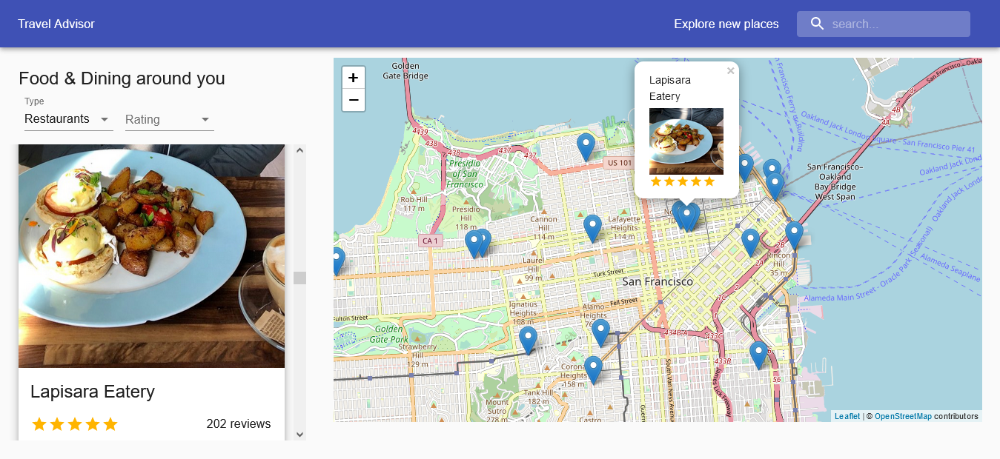

# travel-advisor
travel advisor react project (with leaflet map and travel advisor api)
<a link="https://reactjs-travel-advisor.netlify.app/">live site :</a>

# project-link

https://reactjs-travel-advisor.netlify.app/
